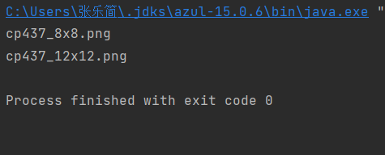

# 在AsciiPanel上进行的Spring Framework实践

[TOC]

## 概述

​		本实验旨在利用SpringFramework，通过配置不同的xml文件，来达到不修改代码便令AsciiPanel使用不同的AsciiFont目的。

## 内容

​		按教程，在resource下创建一个config8x8.xml文件描述架构。

```xml
<?xml version="1.0" encoding="UTF-8"?>

<beans xmlns="http://www.springframework.org/schema/beans" xmlns:xsi="http://www.w3.org/2001/XMLSchema-instance" xsi:schemaLocation="http://www.springframework.org/schema/beans
          http://www.springframework.org/schema/beans/spring-beans.xsd">

    <bean id="font" class="asciiPanel.AsciiFont">
        <constructor-arg index="0" value="cp437_8x8.png"/>
        <constructor-arg index="1" value="8"/>
        <constructor-arg index="2" value="8"/>
    </bean>
    <bean id="panel" class="asciiPanel.AsciiPanel" scope="singleton">
        <property name="asciiFont" ref="font"></property>
    </bean>

</beans>
```

​		如图，AsciiFont采取通过构造器注入的方式初始化，AsciiPanel通过setter函数进行注入。完成xml文件后，创建一个Main函数进行测试。

```java
import  asciiPanel.AsciiPanel;
import asciiPanel.AsciiFont;
import  asciiPanel.AsciiCharacterData;
import org.springframework.context.ApplicationContext;
import org.springframework.context.support.ClassPathXmlApplicationContext;

public class Main {
    public static void main(String[] args) {
        ApplicationContext context = new ClassPathXmlApplicationContext("config8x8.xml");
        AsciiPanel panel=(AsciiPanel) context.getBean("panel");
        System.out.println(panel.getAsciiFont().getFontFilename());

        context=new ClassPathXmlApplicationContext("config12x12.xml");
        panel=(AsciiPanel) context.getBean("panel");
        System.out.println(panel.getAsciiFont().getFontFilename());
    }
}

```

​		首先获取上下文，创建一个Spring支持的工厂，接着用其生产出需要的AsciiPanel对象。测试结果如下：

